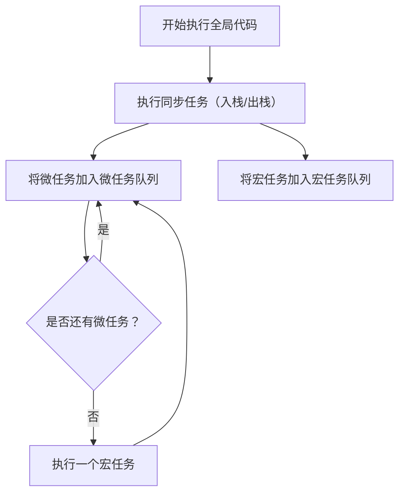

JavaScript 的 **事件循环（Event Loop）** 是实现异步编程模型的核心机制。理解事件循环有助于你掌握 JavaScript 的执行流程、异步任务（如 `setTimeout`、`Promise`）的调度方式。

---

## 一、JavaScript 是单线程的

JavaScript 在浏览器和 Node.js 中通常都是**单线程**运行的：一次只能执行一个任务。这就带来了异步编程的需求，比如处理网络请求、定时器等。

---

## 二、执行机制总览

JavaScript 的运行机制主要包括以下几个部分：

- **调用栈（Call Stack）**：记录正在执行的函数。
- **任务队列（Task Queue / Callback Queue）**：

  - **宏任务（Macro Task）**：如 `setTimeout`、`setInterval`、`setImmediate`、`MessageChannel`、`I/O`。
  - **微任务（Micro Task）**：如 `Promise.then`、`queueMicrotask`、`MutationObserver`。

- **事件循环（Event Loop）**：协调调用栈和任务队列。

---

## 三、事件循环运行流程

下面是事件循环的简化流程图解：

1. 执行全局同步代码（入栈、出栈）；
2. 执行所有微任务（MicroTask Queue，优先于宏任务）；
3. 执行一个宏任务（MacroTask Queue）；
4. 重复步骤 2 和 3。

---

## 四、示例分析

```js
console.log("start");

setTimeout(() => {
  console.log("timeout");
}, 0);

Promise.resolve().then(() => {
  console.log("promise");
});

console.log("end");
```

**输出顺序：**

```
start
end
promise
timeout
```

**解释：**

1. `start` 和 `end` 是同步任务，直接执行。
2. `Promise.then(...)` 是微任务，在当前宏任务执行完后立即执行。
3. `setTimeout` 是宏任务，在下一轮事件循环中执行。

---

## 五、宏任务 vs 微任务

| 类型   | 举例                             | 调度顺序                       |
| ------ | -------------------------------- | ------------------------------ |
| 宏任务 | `setTimeout`、`setInterval`      | 每轮事件循环执行 1 个宏任务    |
| 微任务 | `Promise.then`、`queueMicrotask` | 每个宏任务后立即清空所有微任务 |

---


