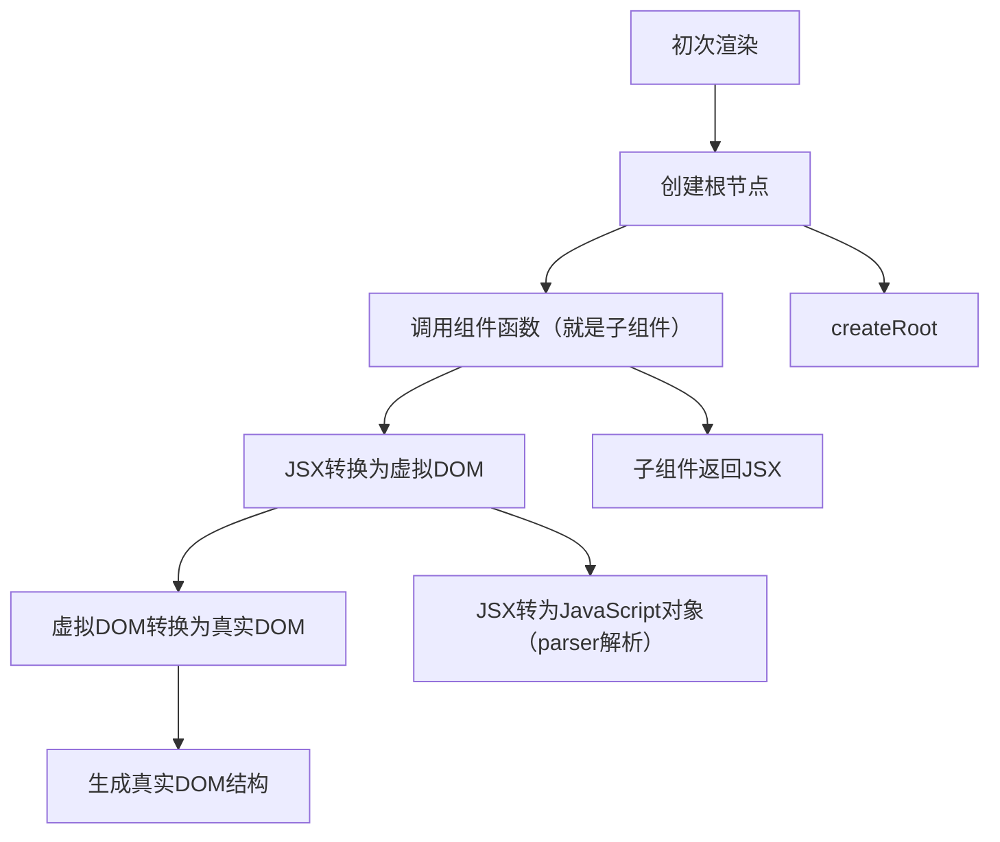

所谓渲染，就是react将组件从JSX的形式转换为DOM，再呈现到浏览器的过程。具体的解析过程是parser的任务，这里不多赘述。我们需要关注的是：
1. 渲染的流程？
2. 什么会触发重新渲染？
3. 有没有优化渲染的东西？
> 明白了上述三点对与学习react原理有很大帮助，可以在面试中狠狠拷打面试官

# 渲染流程
## 初次
首先要考虑初次渲染，也就是打开一个url界面会发生什么

差不多是这个过程，左边是主流程，右边是发生了什么。用人话讲就是根据app这个root创建对应的根，再深度优先地遍历子组件，对每个组件都parse成js，构造成一个虚拟的dom树，然后映射地打印成真实dom

## 更新
> React的运行机制可以用一个函数表示：`view = f(state)` ，`view`表示页面，`state`表示数据。在初次渲染后，state更新会引起组件的重新渲染，并且只有state可以引发重新渲染。当一个组件重新渲染时，它的所有子组件也会重新渲染。

这基本上就是更新的精髓所在，源码解析里补充了触发渲染的核心就是state的改变、hooks调用、context改变，后两者本质上也只是以不同方式动了state，都会导致重新渲染部分组件。
然后这里有个关注点：**当一个组件重新渲染时，它的所有子组件也会重新渲染。** 是个人都能看出这里会造成不必要的渲染开销（没有依赖props的子组件也重新渲染了），而react在设计时不是没考虑到，而是如果逐个子组件分析props的话更加麻烦，那还不如全部渲染

# 优化
### 有没有什么办法可以不要全部重新渲染？？？
> 有的兄弟，有的

你需要一行神秘代码
`const MemoizedComponent = React.memo(Test);`
这么一来相当于react记住了Test的状态，它如果是没有接受props的话就不会在父组件重新渲染的情况下重新渲染了；but如果有接受props怎么办，那就需要useMemo/useCallback了，前者缓存结果，后者缓存函数，在性能出问题的时候可以用。

# 总结
比较水的一篇，重新梳理了渲染流程，可以帮助理解fiber。