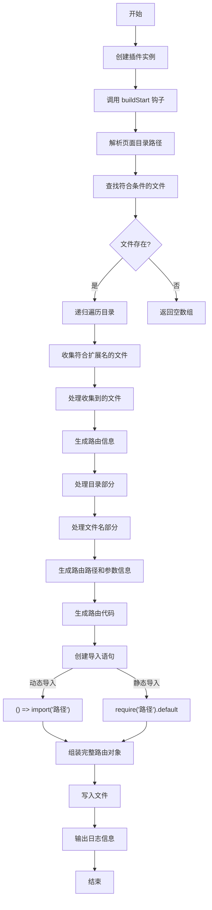

# 简单介绍和约定

Rollup插件本身是一个需要属性、构建钩子、输出构建钩子的特定对象

## 何为Rollup钩子

说人话就是rollup在构建的时候不同阶段用的函数。分为`构建钩子`和`输出生成钩子`比如构建开始的时候使用`buildStart`，输出结束的时候使用`generateBundle`。

## 实战：开发一个路由分析插件

该插件能够在构建开始时解析指定目录下的路由文件，并生成路由信息。它会递归遍历目录，查找符合条件的文件，并根据文件名和路径生成路由对象。最后，它会将生成的路由信息写入文件，并输出日志信息。

在代码中使用了`buildStart`钩子这一rollup常用的钩子函数。该钩子在构建开始时被调用，可以用于初始化插件的状态或执行一些准备工作。
