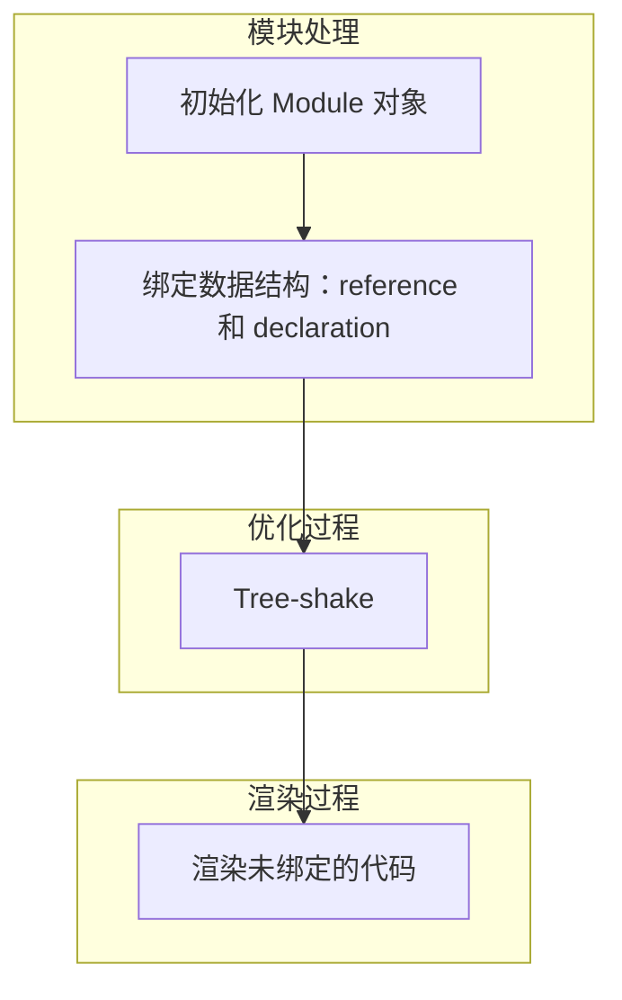

rollup会将小分散的模块打包📦为大模块，在这个过程中会进行复杂的依赖分析（选项分析，图构建），tree shaking优化（此树即为ast；值得一提的是这里的思想确实借鉴了垃圾回收，我的直觉是对的😋），代码分割（分为chunk）。最终生成最小bundle

基本用法可见[官方教程](https://www.rollupjs.com/tutorial/) ,主要包括cli, config的不同配置。cli能力还是比较有限（源码里占比也不多），开发肯定还是直接用配置文件。配置内容包括：

1. 入口
2. 输出
3. 插件
   是不是很简单明了，那我们不妨再探索地深一点，看看它的源码架构吧

# 数据结构

看解析的时候惊人地发现这里也有状态机的身影👀

1. Module：单个文件对应一个module
2. Statement：本质上是状态机，携带了ast node的不同信息
3. Declaration：简单来说是一个实例，
4. Reference：调用语法，类似a.b
5. Scope：节点作用域，找到节点定义变量

# 简化流程图

# 优化原理

- tree-shaking：

> rollup不看你引入的函数，而是看你调用的函数。调用的函数不在本模块就会到父级scope去寻找。

根据此原理，rollup会优化掉你引入了但是没调用的函数，跟标记清除的原理略有类似

- code- split：根据依赖，将模块划分为不同的 chunk
- dynamic-import：
