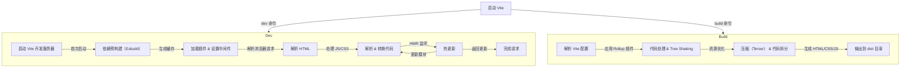

## 🔥 vite核心概念

vite是什么：一个基于 ES 模块（ESM）和原生浏览器支持的**构建工具**，主要用于前端开发和生产构建，相比 Webpack 具有更快的启动速度和更高效的 HMR（热更新）。简单来说就是优化开发者开发体验的工具，是一个**集成开发服务器+生产构建工具**

- 开发阶段：直接使用 ESM，避免不必要的打包，速度极快。
- 生产阶段：基于 Rollup 进行优化打包，生成高效的静态资源。
### 主要特点：

1. ES 模块（ESM）

   Vite 直接使用原生 ESM（ES Modules），浏览器会**按需加载模块**，而不是像 Webpack 一样打包所有内容。

2. 预构建

   Vite 在启动时，会**提前优化第三方依赖**（如 Vue、React），将其转换为 ESM 格式，提高加载速度。

   优化的原因：
   - 默认的 npm 包通常是 CommonJS 格式，不适用于浏览器 ESM 加载。
   - Vite 会缓存预编译结果，加快后续启动速度。

3. HMR 热模块替换
   - 直接替换 发生变化的模块，无需重新打包整个项目。
   - 利用浏览器缓存，避免重复请求未更改的模块。
## 启动过程

目前正在开发rolldown（rust编写的高性能底层打包器）以替换esbuild和rollup