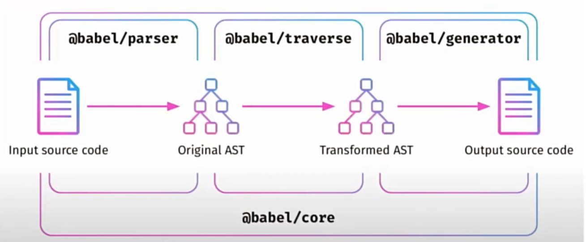

babel是一个流行JS编译器，主要将ES6+,ts,jsx转为兼容性更好的ES5代码，以支持更多运行环境。

### Plugin

Babel 的 插件 本质上是一个函数，它会接收 Babel 的 AST，然后修改 AST，最终 Babel 重新生成 JavaScript 代码。

**Babel 插件的运行机制：**

1. 解析（Parse）：将代码解析为 AST。
2. 访问（Traverse）：遍历 AST，并进行变换。
3. 生成（Generate）：根据新的 AST 生成新的 JavaScript 代码。

插件可用于：

- 语法转换（如 const → var）
- 代码优化
- 插入 polyfill（垫片）
- 自定义代码转换

### Loader

Loader 是 Webpack 的概念，用于在 Webpack 构建过程中，处理不同类型的文件。而 `babel-loader` 主要负责调用 Babel 进行代码转换，使其能够与 Webpack 结合使用。
