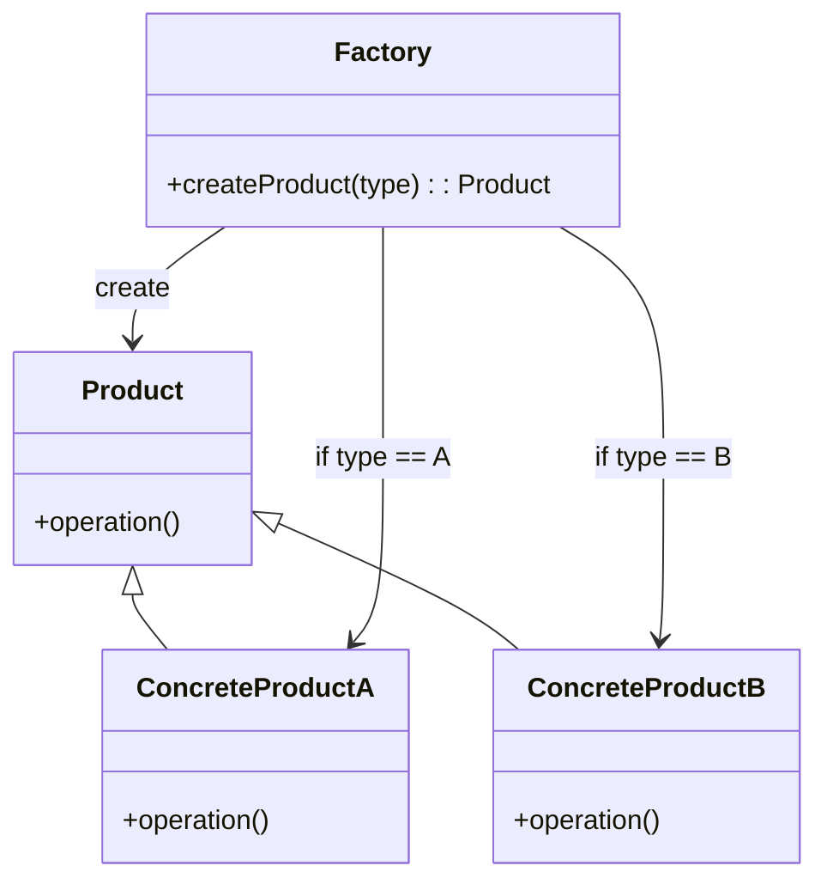
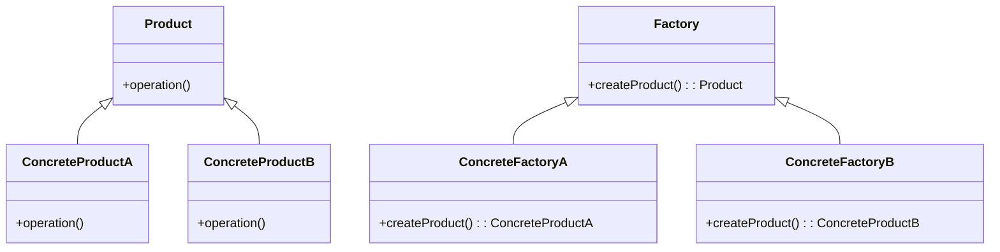

挖个坑，作为学习设计模式的笔记
🔗：https://design-patterns.readthedocs.io/zh-cn/latest/index.html

# 创建型

## 简单工厂

一句话：根据传入的参数决定返回的抽象类实例
🌰：封装组件库

说明：

- `Product` 是一个抽象类，定义了产品的接口。
- `ConcreteProductA` 和 `ConcreteProductB` 是具体的产品类，实现了 `Product` 接口。
- `Factory` 是工厂类，负责创建产品实例。它根据传入的类型参数决定创建哪种具体产品。
- `createProduct` 方法是工厂方法，根据传入的类型参数返回相应的产品实例。
- 这种模式的优点是将对象的创建与使用分离，使得代码更加灵活和可扩展。
- 但是，简单工厂模式的缺点是增加新的产品类型时需要修改工厂类的代码，违反了开闭原则，适用于产品种类较少的情况。

# 工厂方法

一句话：不直接实现产品实例，而实现工厂实例，通过工厂示例生产产品实例

说明：
进一步解耦，现在生产新产品不需要动工厂的底层代码，直接写个新工厂方法和产品类即可，缺点是复杂度变高

# 抽象工厂
